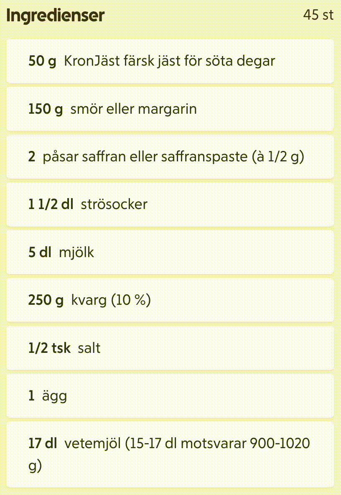

# Stupid hackathon 2025 - Relatable Recipes

Submission for the Stockholm Stupid hackathon 2025.
Replaces measurment/units of [ICA recipes](https://www.ica.se/recept) to everyday relatable things for an easier cooking experience.

The new "units" are written in swedish to match ICAs recipes.



### Minified version for bookmarklet use
```javascript
javascript:!function(){const a=document.querySelectorAll(".ingredients-list-group__card__qty"),e=[{name:"pingisboll",plural:"pingisbollar",weight:2.7},{name:"A4-pappersark",plural:"A4-pappersark",weight:5},{name:"öra",plural:"öron",weight:7},{name:"nyckel",plural:"nycklar",weight:10},{name:"ciklidhona",plural:"ciklidhonor",weight:15},{name:"ladusvala",plural:"ladusvalor",weight:20},{name:"strumpa",plural:"strumpor",weight:35},{name:"delicatoboll",plural:"delicatobollar",weight:40},{name:"gaffel",plural:"gafflar",weight:50},{name:"sexa tequeila",plural:"sexor tequila",weight:60},{name:"kattunge",plural:"kattungar",weight:90},{name:"sibirisk jordekorre",plural:"sibiriska jordekorrar",weight:100},{name:"banan",plural:"bananer",weight:110},{name:"blöt disktrasa",plural:"blöta disktrasor",weight:150},{name:"sandig barnsko",plural:"sandiga barnskor",weight:170},{name:"datormus",plural:"datormöss",weight:200},{name:"stadsduva",plural:"stadsduvor",weight:280},{name:"vhs-kassett",plural:"vhs-kassetter",weight:300},{name:"liten hammare",plural:"små hammare",weight:330},{name:"225mm hovtång",plural:"225mm hovtänger",weight:380},{name:"L2 gasolflaska",plural:"L2 gasolflaskor",weight:450},{name:"torr näbbdjurshona",plural:"torra näbbdjurshonor",weight:1e3},{name:"värphöna",plural:"värphönor",weight:2e3}];function r(a){const r=function(a){let r=e[0],t=Math.abs(a-r.weight);for(const l of e){const e=Math.abs(a-l.weight);e<t&&(t=e,r=l)}return r}(a),t=a/r.weight,l=t%1==0?t:parseFloat(t.toFixed(1));return`${l} ${l>1.5&&r.plural?r.plural:r.name}`}a.forEach((a=>{const e=function(a){const e=a.match(/(\d+\/\d+|\d+\.?\d*)\s*(g|kg|tsk|msk|dl)/i);if(!e)return null;let r=e[1];const t=e[2].toLowerCase();if(r.includes("/")){const[a,e]=r.split("/").map(Number);r=a/e}else r=parseFloat(r);return function(a,e){switch(e){case"kg":return 1e3*a;case"tsk":return 4*a;case"msk":return 15*a;case"dl":return 85*a;default:return a}}(r,t)}(a.textContent.trim());if(null!==e){const t=r(e);a.textContent=t,a.style.backgroundColor="#ffffcc"}}))}();
```